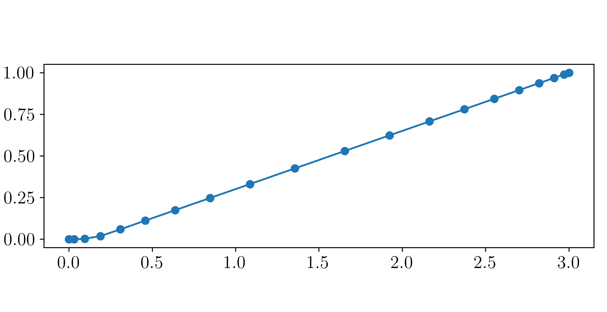
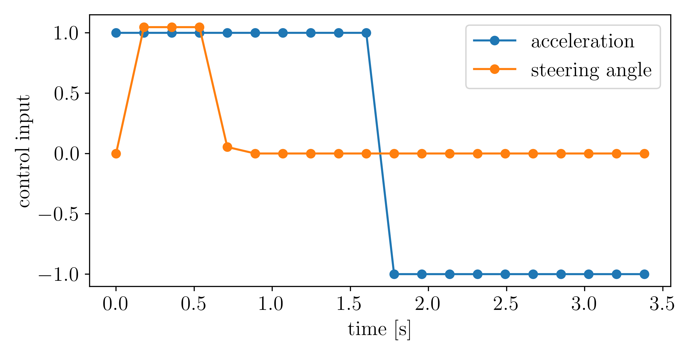
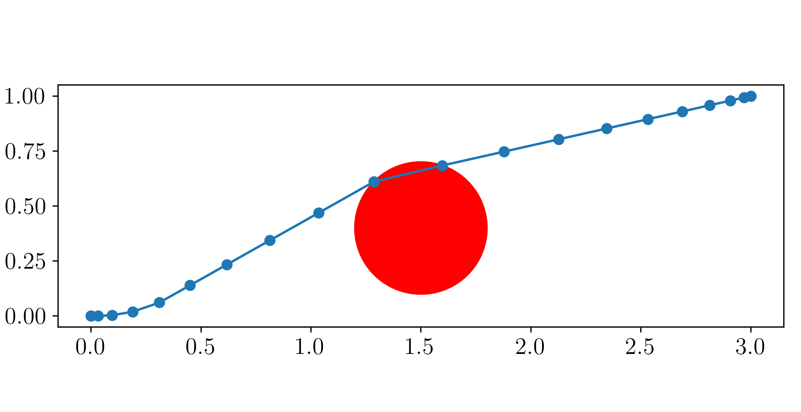
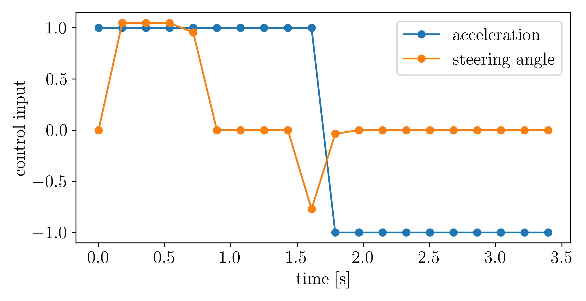
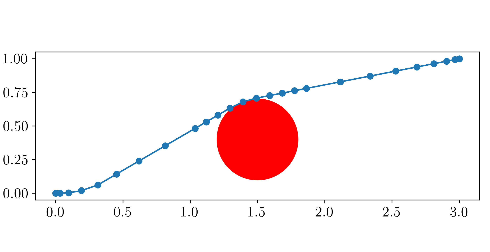
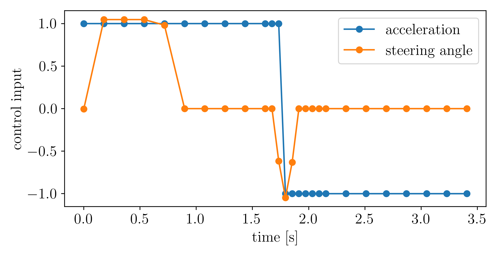
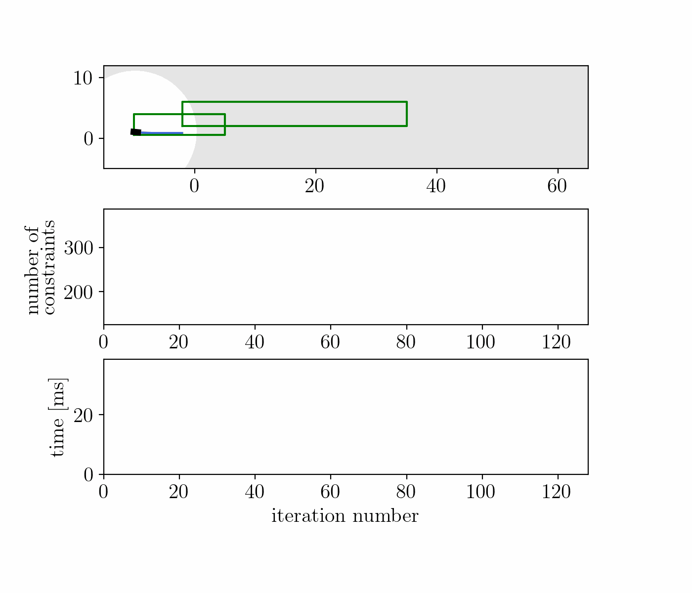
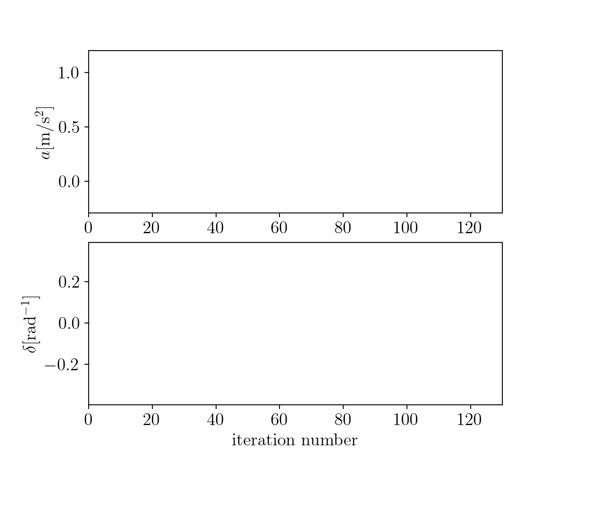
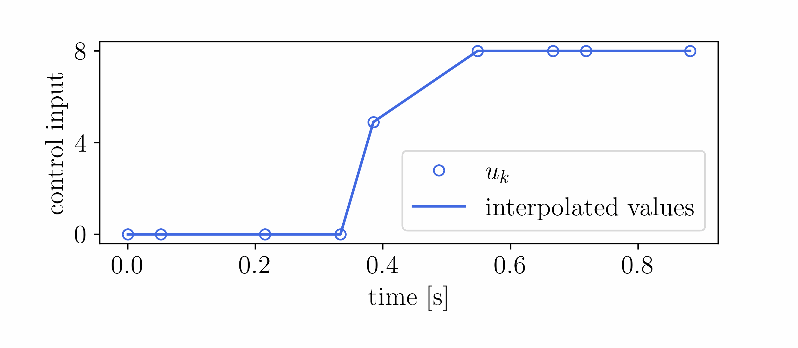
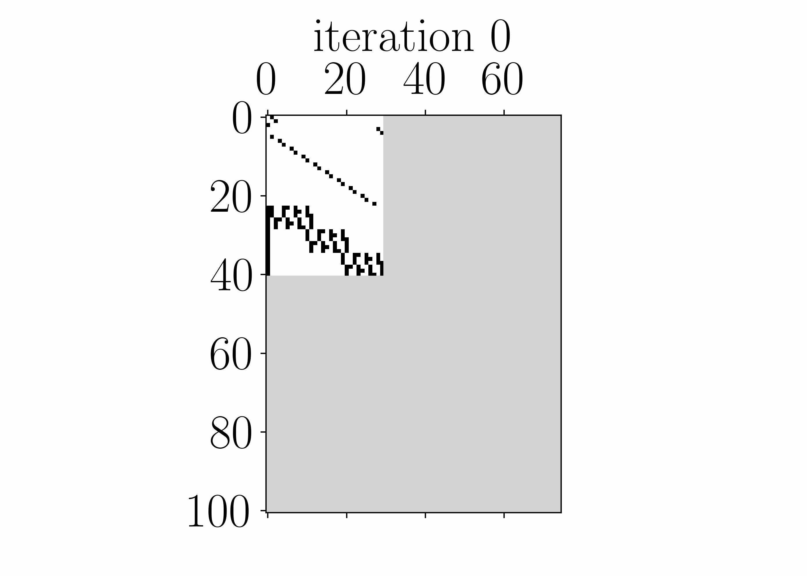

# AdaptiveNLP
a Framework for Efficient Online Adaptability in NLP
Structures for Optimal Control Problems


## Installation
To use the framework, first clone this repo locally
```
git clone git@gitlab.kuleuven.be:meco-projects/adaptivenlp.git
```


Casadi needs to be built from source.
```
sudo apt install gfortran liblapack-dev pkg-config --install-recommends
sudo apt install swig
cd
git clone https://github.com/casadi/casadi.git -b master casadi
cd casadi
mkdir build
cd build
cmake -DWITH_PYTHON=ON -DWITH_IPOPT=ON -DWITH_OPENMP=ON -DWITH_THREAD=ON ..
make
sudo make install
```

**AdaptiveNLP** also makes use of the Eigen library in c++
```
sudo apt install libeigen3-dev
```

## Running the examples
In the newly created `adaptivenlp` repo, build the executibles by executing
```
mkdir build
cd build
cmake ..
cmake --build .
```
The executibles for every example are located in the folder `adaptivenlp/build/examples`. The output of an example with name EXAMPLE_NAME is written in the folder `adaptivenlp/examples/EXAMPLE_NAME/plotting_data/` which also contains python scripts that read that data and create figures in the folder `adaptivenlp/examples/EXAMPLE_NAME/figures/`.

### Example 1: minimal example
This minimal example demonstrates how changes can be made to an AdaptiveNLP instance. A simple vehicle performs a time-optimal point-to-point motion.
<p align="float">


</p>

Next, an obstacle is introduced and a no-collision constraint is added.
<p align="float">


</p>

However, the vehicle now collides with the obstacle because the no-collision constraint is only enforced on discrete points. Therefore, we locally refine the grid.
<p align="float">


</p>


### Example 2: AdaptiveCorridorExample (MPC-example)
In this example, a vehicle has to move through a warehouse environment. For some parts of the warehouse, free-space corridors (in which no obstacles are present) are known to the vehicle. In other parts of the warehouse, such information is not available and the vehicle has to detect obstacles and avoid them. The vehicle also might encounter people to which it can only get close if it slows down for safety reasons.

The top figure in the animation below shows the vehile moving through the free-space corridors while avoiding the people. It is also detecting and avoiding the obstacles. The middle figure shows the number of constraints present in the problem over the different MPC iterations. It shows the corridor constraints in green, the safety constraints in blue and the no-collision constraints in red. The bottom figure shows some computation times. The gray line is the CasADi Opti 1 case that solves the same NLP every iteration. The orange line is the CasADi opti 2 case that constructs a new opti instance every MPC iteration with only the constraints deemed necessary. The blue line is the AdaptiveNLP case that modifies the previous NLP to add or remove constraimts.
<p align="float">


</p>


### Example 3: Moonlander example
The goal in this example is to land a moonlander as fast
as possible on the surface of the moon without crashing into
it. The lander is subject to a lunar gravitational pull and has one thruster to be used to slow down. This problem is solved using an adaptive gridding method to represent the bang-bang solution accurately on a discrete time-grid.

The animations below show the control inputs and the constraint Jacobian sparsity structures resulting from the grid refinements.

<p align="float">


</p>

## License
TODO

