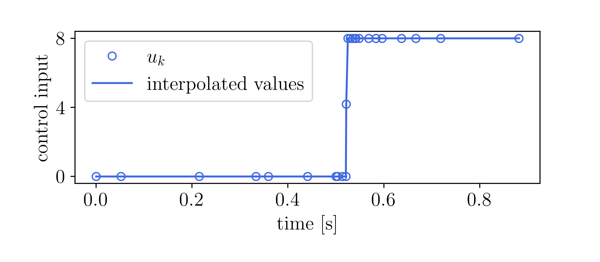

# AdaptiveNLP
a Framework for Efficient Online Adaptability in NLP
Structures for Optimal Control Problems


## Installation
To use the framework, first clone this repo locally
```
git clone
```


Casadi needs to be built from source.
```
sudo apt install gfortran liblapack-dev pkg-config --install-recommends
sudo apt install swig
cd
git clone https://github.com/casadi/casadi.git -b master casadi
cd casadi
mkdir build
cd build
cmake -DWITH_PYTHON=ON -DWITH_IPOPT=ON -DWITH_OPENMP=ON -DWITH_THREAD=ON ..
make
sudo make install
```

**AdaptiveNLP** also makes use of the Eigen library in c++
```
sudo apt install libeigen3-dev
```

## Running the examples
In the newly created `adaptivenlp` repo, build the executibles by executing
```
mkdir build
cd build
cmake ..
cmake --build .
```
The executibles for every example are located in the folder `adaptivenlp/build/examples`. The output of an example with name EXAMPLE_NAME is written in the folder `adaptivenlp/examples/EXAMPLE_NAME/plotting_data/` which also contains python scripts that read that data and create figures in the folder `adaptivenlp/examples/EXAMPLE_NAME/figures/`.

### Example 1: AdaptiveCorridorExample (MPC-example)
In this example, a vehicle has to move through a warehouse
environment. For some parts of the warehouse, free-space
corridors (in which no obstacles are present) are known to the
vehicle. In other parts of the warehouse, such information is
not available and the vehicle has to detect obstacles and avoid
them. The vehicle also might encounter people to which it
can only get close if it slows down for safety reasons

<!--  -->

<p align="center">

</p>

### Example 2: Moonlander example
The goal in this example is to land a moonlander as fast
as possible on the surface of the moon without crashing into
it. The lander is subject to a lunar gravitational pull and has one thruster to be used to slow down. This problem is solved using an adaptive gridding method to represent the bang-bang solution accurately on a discrete time-grid.

<!--  -->

<p align="center">

</p>

<!--  -->
<p align="center">

</p>

## License
TODO

